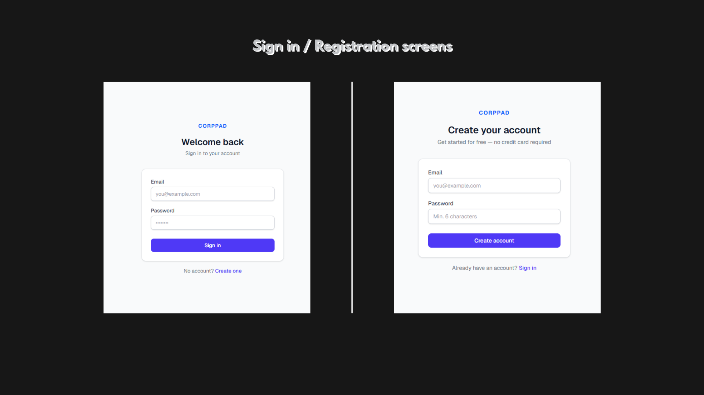
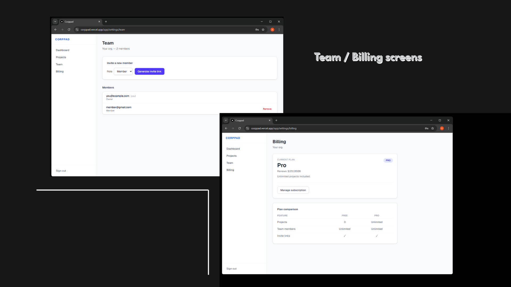

# Corppad — SaaS MVP Starter (Demo)

Live demo : https://corppad.vercel.app

Reusable SaaS MVP starter demo (Upwork portfolio): Next.js App Router + TypeScript + Tailwind + Supabase (Auth/DB/RLS) + Stripe (Free/Pro).

## What’s included
- Auth: register/login/logout (Supabase)
- Organizations: onboarding creates an org + adds current user as **Owner**
- Roles: **Owner / Admin / Member**
- Projects:
  - CRUD + search + simple pagination
  - **Free limit: 3 projects per org**
- Team:
  - member list
  - invite link (copy) + accept flow `/invite/[token]` (no emails)
- Billing:
  - Stripe Checkout upgrade to **Pro**
  - Webhook sync → org plan stored in DB
  - Pro removes the projects limit

## Tech stack
- Next.js (App Router) + TypeScript
- Tailwind (no UI libraries)
- Supabase: DB + Auth + RLS
- Stripe: subscriptions (test mode)

## Local setup

### 1) Database (Supabase)
Supabase → SQL Editor:
1) run `src/lib/db/schema.sql`
2) run `src/lib/db/rls.sql`

### 2) `.env.local`
Create `.env.local` (ignored by git) with the minimum:

(see .env.local.example)

### 3) RUN

```bash 
npm i
npm run dev
```

### Screenshots 

### 1) Login


### 2) Dashboard/Projects


### 3) Teams/Billing
